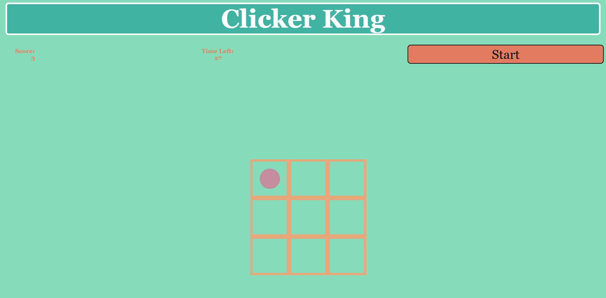

# CLICKER KING

## About

Have you been wanting to become a pro Valorant player all your life (or since 2020) but always had bad aim? Can't stand getting roasted by in the Discord channel for going 0-19? WELL LOOK
NO FURTHER BECAUSE **CLICKER KING** IS HERE FOR YOU. Through its rigerous 30-second aiming time trials you can not only work on that wrists conditioning but also its strength and speed
all in one go. Its basically the Bowflex for your wrist. So change your life TODAY by playing **CLICKER KING**

Clicker King is a simple aiming and clicking game where youre given a 3x3 board as a playing field where a dot can showup at any moment once you press the start button. From there, you 
will have 30-seconds to aim and click the target as many times as you can before the timer runs out. Once complete, you can see where your current speed stands and work towards a better
score on your next replay! 

### Getting Started
- The game will start with a blank board and waiting for the player to press start 
- The timer will be set to 30, begin its countdown and begin to show targets on the board which the player needs to click before they dissapear 
- At the end of the 30-seconds the player will recieve their score and some feedback regarding their performance. 
- ENJOY!

**CLICK HERE TO PLAY** [Clicker King](https://zainamirza.github.io/Clicker-King/)

### Screenshots 

**Starting Board** 

**Board During Gameplay**

**Win**

**Loss**

### Technologies Used
- HTML
- CSS
- JavaScript
- Stack Overflow

### Future Updates
- Expand the board further as time goes on, adding difficulty 
- Add certain powerup or punishment circles that add extra points or take some away
- Add sounds to clicks and timer to make it more immersive 